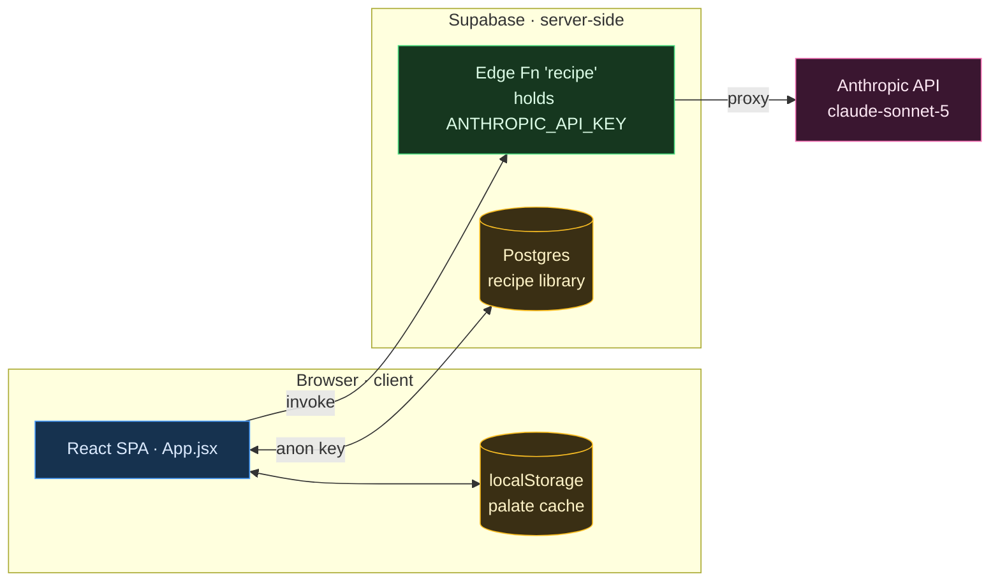

# Architecture: Ein Mehr Beissen Bitte — System Overview

> **TL;DR:** React meal-calendar SPA. Recipes are generated on demand by Anthropic, proxied through a Supabase Edge Function so the API key stays server-side. A Postgres recipe library and localStorage cache back it.

## The shape

## Scope & surface
- **Trust boundary:** client vs. Supabase. The `ANTHROPIC_API_KEY` is correctly **server-side** in the Edge Function — never in the client bundle.
- **No WAF.** DB access from the client rides the Supabase **anon key + RLS** only; the client trusts its own localStorage.
- Data flow: UI event → `callClaude` → `supabase.functions.invoke("recipe")` → Edge Function → Anthropic → JSON recipe.

## Invariants
- `src/App.jsx` holds the inline `chains` meal data (single source of truth) and calls generation directly.
- `useRecipe` / `usePalate` / `PaletteQuestionnaire` are richer machinery **not yet wired** into `App.jsx`.

## Where things live
See `CLAUDE.md` (L0 map) for core files and data shapes.

## Related
- [[00-Index/Home]]
